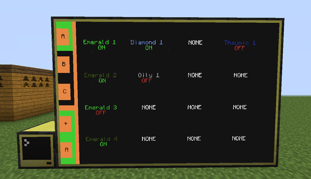
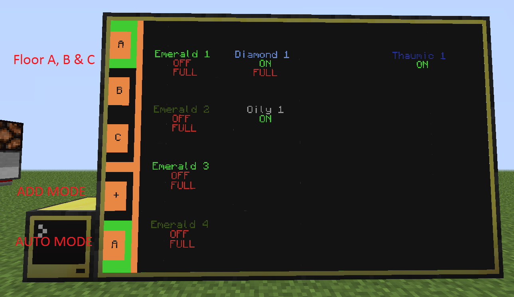
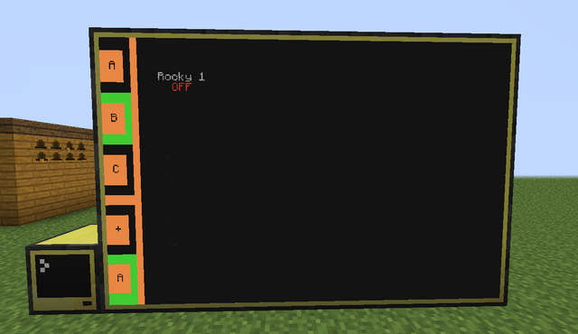
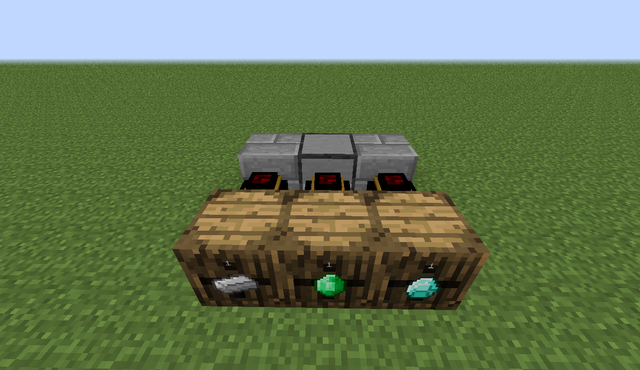
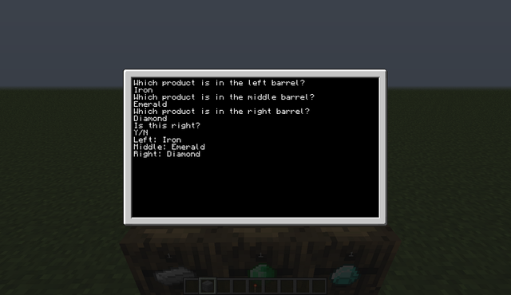
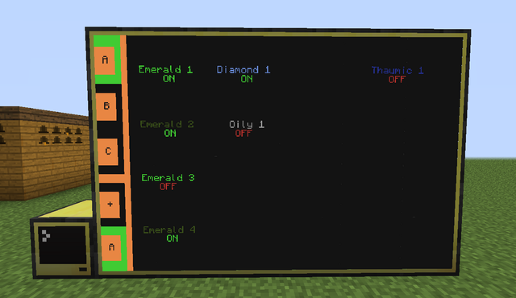
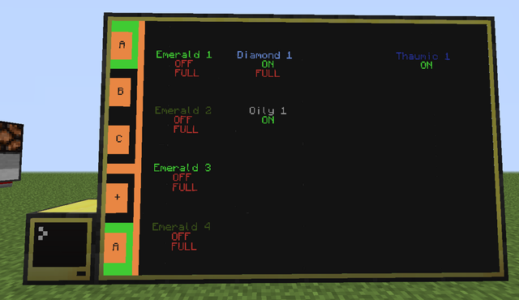
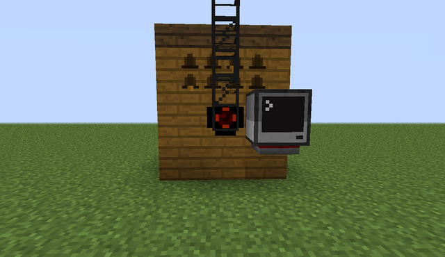
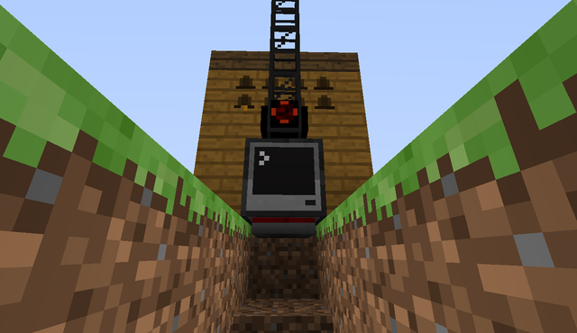

Tutorial and Demo: https://www.youtube.com/watch?v=8-K9PMZao0E

CC Forum Post: https://web.archive.org/web/20230213095022/http://www.computercraft.info/forums2/index.php?/topic/13497-beekeeper-system-for-generikb/page__p__126409#entry126409

CC Forum Post Text:

Hello everyone,
some days ago, Generikb talked about a way to control his alvearies and to easyly see what is going on.
I tought "That has to be done with ComputerCraft" and i implemented some ideas. The finished product is the

# BEEKEEPER-SYSTEM

## Features

- 4x6 monitor screen
- Mega Alveary design included by having three 4x4 layers on the screen
- fairly easy to set up and change various settings like the individual text color
- it shows for every alvearys:
--- which kind of bee is in it
--- if it is working or not
--- if a storage unit is full of the product this bee makes
- live updates on the screen
- automatic shutdown when a storage unit is full (toggleable)
- manuell shutdown or start every alveary individually

## How to install and use

You are going to need an advanced computer plus 24 advanced monitor blocks. Place them like shown in the picture above. Attention: You have to put (shift+rightclick) a modem on the back side of the advanced computer.
Rightclick on the computer and give the computer a name. You have to do this otherwise the computer wont save variables and programs. Tipe in it the following code and hit Enter
label set BeeKeeperConsole

Then copy the following code and paste it into the computer (Ctrg+V):
<code>pastebin get 4Wstw0Px startup</code>

Then start the program with:
<code>startup</code>

Now you should be able to see stuff on the big monitor. You can rightclick buttons on the left side of the screen to switch beween different modes:

### FLOOR LEVELS
You can select between floor A, B and C to get information about 16 of the 48 alveary slots.
If you are rightclicking one of the alvearies, they are get turned on or off.
ADD, CHANGE. DELETE & SWITCH
When the ADD mode is selected, you can select any free alveary slots on the screen or even existing ones to change, switch or even delete them.
Spoiler 

If you are going to add a new alveary slot, all the following names and numbers are important!!!! Please remember them!
After hitting a slot, you have to enter a name.
Then you have to tipe in a number between 1 and 10. You shouldnt use the same number twice for the same name. If you are having e.g. two "Emerald 1" the alvearies wont get shutdown individually.
At the third point you have to tipe in the name of the product, which gets produced in this alveary.
The last one is a little fun feature. You can go ahead and select from 14 different colors to determinate this kind of alveary better.
The name plus number should be writting in the selected color on the screen now. Before hitting anything else, lets move on:

For every alveary you have, you need one normal computer and one modem as well as an standard autarchic gate.
Place the gate on the pipe and the computer next to it. The modem goes on the bottom side of the computer.

The gate has to be set like this: If redstone signal is on then pump stuff out.
If you want to you can place a lamp next to the computer. It will indicate if the alveary is working.

Rightclick the computer and label it once again. The names you give every computer should be different and individually!!! Please dont use the same name twice.
label set alvearyComputer1

Then copy and paste this code into the computer:
<code>pastebin get 9rBkGRu9 startup</code>

And start it with
<code>startup</code>

You get asked two questions:
A name and a number. These are the same you set at the advanced computer!!!
Do that for every alveary you have.
If you want to change this alveary, then simply hit a button on your keyboard and it let you set the variables again.

You accually are done at this point. You can manually shutdown every alveary individually.

However, you can let them shutdown by themselfs if e.g. a barrel of chest went full with items.
You need one normal computer, three pipes, three normal gates, two solid blocks and one modem.
Attention! The computer's front is facing to the right and gets blocked by the right stone brick. The modem goes on right side of the computer (the opposite side we cant see because the computer itself is in the way). If you are having setting it up, watch the overview video above.

Set all gates like this: If inventory is full then redstone signal on

Open up the computer and label it:
label set storageComputer1

Then copy and paste:
<code>pastebin get vTFJfqEt startup</code>
and start it with
<code>startup</code>

You get asked which items are in the storage units:
The names you set here, have to be the same you gave the alveary slots in the advanced computer (product name)!
Whenever a storage unti runs full, a "FULL" shows up underneath every alveary slot, which produces this kind of item.

## AUTO MODE
If you enabled this mode, it will shutdown or start alvearies automatically if the storage unit with the product is full or
has space in it. You still can go ahead and turn alvearies on or off by yourself!

## EASTER EGG
You can change the color of the menu on the left side by clicking on its frame.

## How to uninstall:

Hold Ctrg+T in the computer. Then write:
<code>delete startup</code>
Hold Ctrg+R and you can use the computer again or download the newest version of BeeKeeper.

## Informations:

I set this system up in around 10 hours and it turned out very well. I hope Generikb is going to use it and if not, i hope you are having fun with it as well ;D

Have a wonderful day

unobtanium

