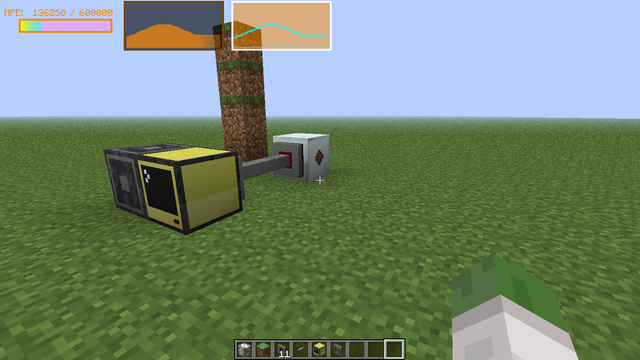
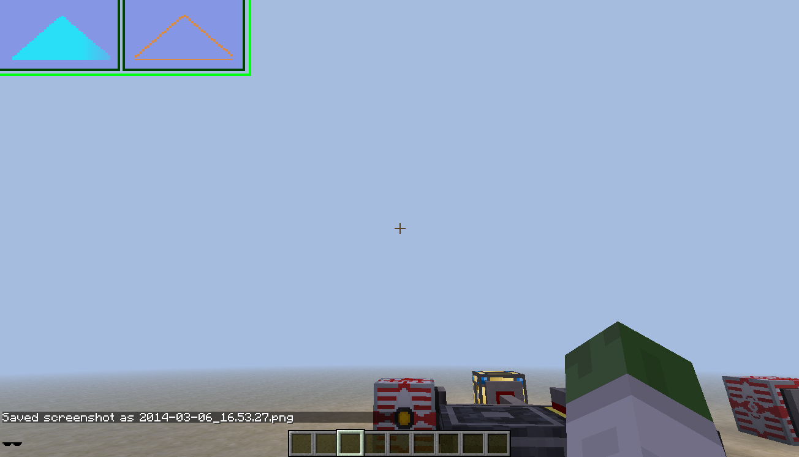
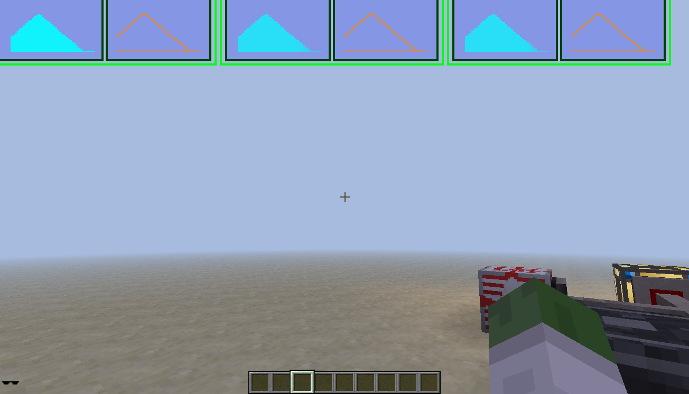
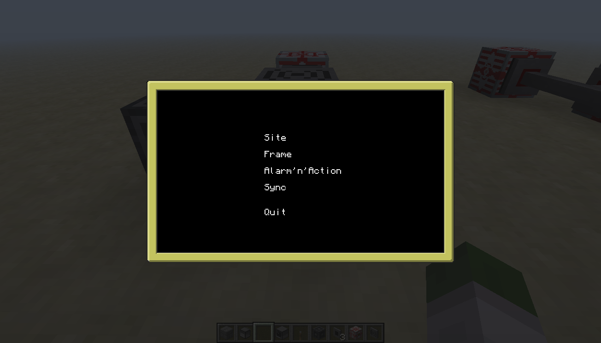
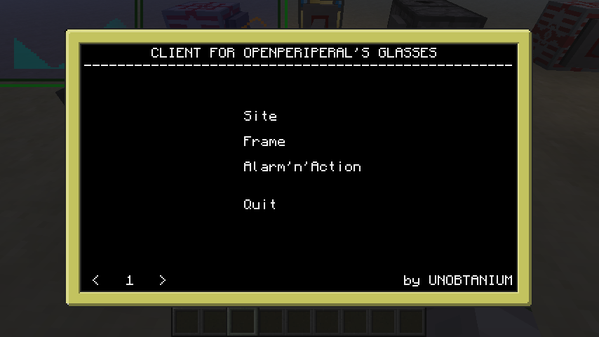
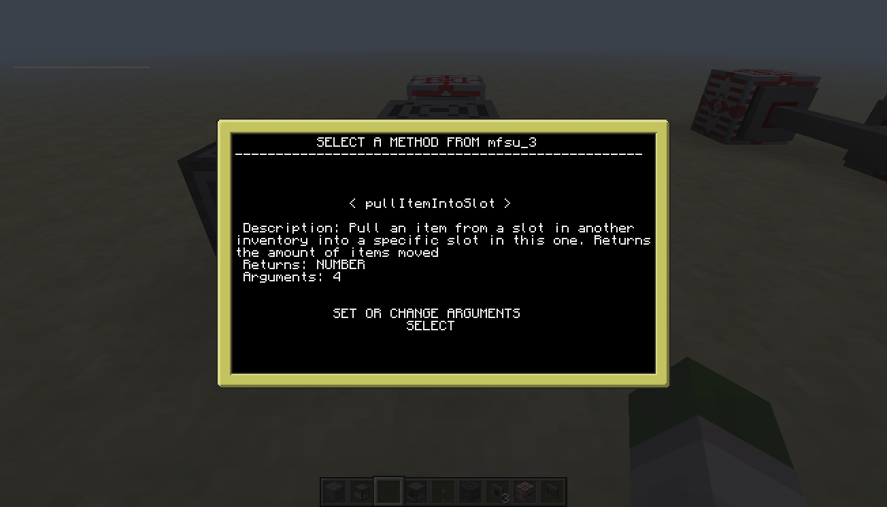
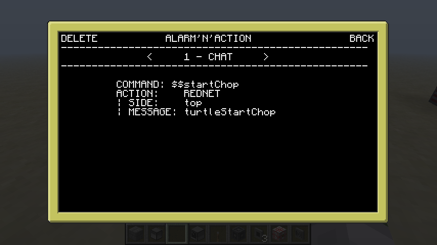
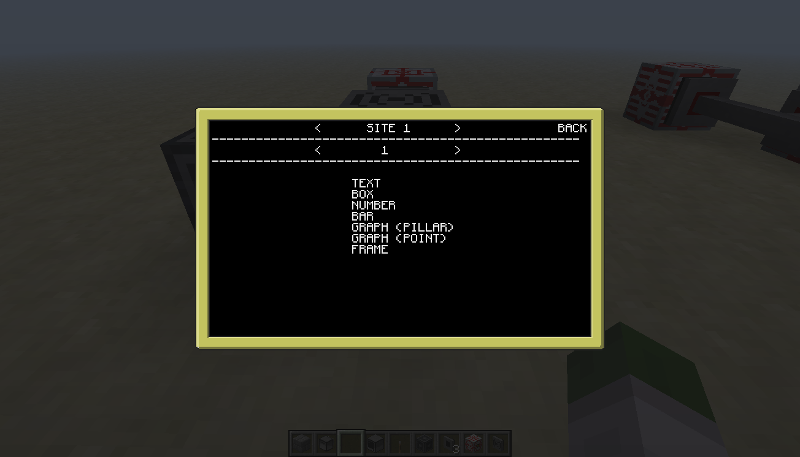
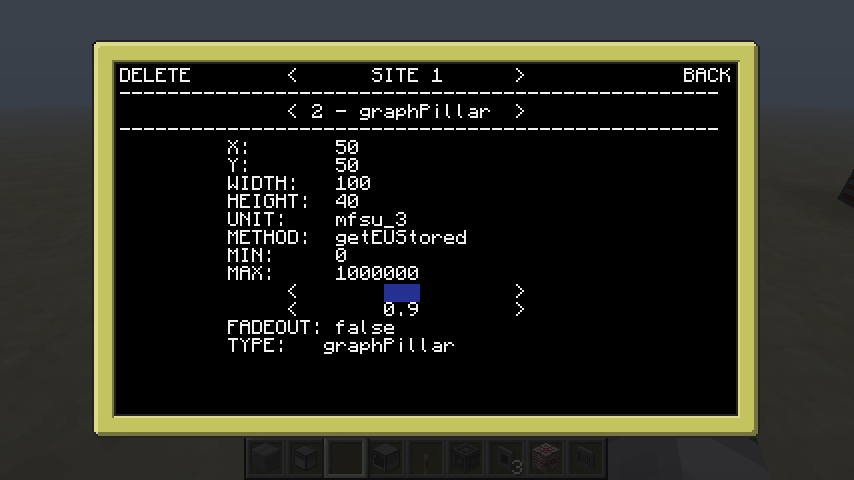
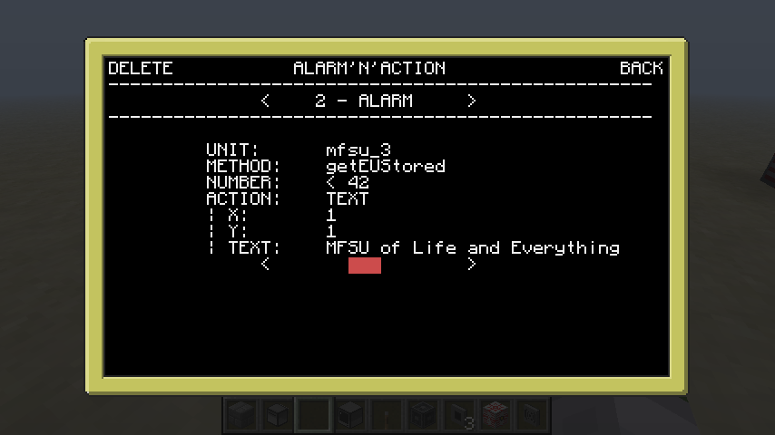

CC Forum Post: https://web.archive.org/web/20230213150649/https://www.computercraft.info/forums2/index.php?/topic/14077-client-for-openperipheral-010/

CC Forum Post Text:

Hello everone,

i recently discovered the awesome OpenPeripheral by OpenMods.
Since then i wanted to make a on screen real time updating, highly userfriendly and easy to configure program for networks.
And this vision turned into a whole client. 

# The "Client for OpenPeripheral's Glasses".

## Features:

- Mouse clicks for interactive and easy configuration
- Show the status of your peripherals (e.g. MFSU, Tanks, Reactor Core and more) on screen
- Multiple objects are preset for example: Box, Progress Bar, Graph (Pillar and Point)
- Individual Arguments can be added for each method
- Change size, colors and transparency of your objects to fit your own screen size and game experience
- Put infinite objects on 99 different and individual sites and call these wireless over chat
- Modular building system with frames
- Create automatic routines, warnings and actions depending on the status of your machines
- Take control over your whole facility simply over your chat system.
- Intelligent positioning on your screen e.g. text allways on top, box allways in the background.
- If you found a bug or your program crashed, tell me about it here in the thread and i will take care of it.

## Download & Installation

You are going to need
- one advanced computer
- one Terminal Glasses Bridge
- one Terminal Glasses
- and a network system with the peripherals you want to have informations from

## Client for Open Peripheral 0.5.2 Download

Place your computer down and the Terminal Glasses Bridge on the left of it. The modem and peripherals are going on the back.
Rightclick with the Terminal Glasses (the item) in your hands the Terminal Glasses Bridge (the block).
Name/label your computer otherwise your settings and programs wont save!

label set \<MyComputerName\>

Paste this code into your computer
<code>pastebin get 56HRGddn startup</code>

And start it with
<code>startup</code>

Old version 0.4.4 (not recommended unless the new version doesnt work for you)
<code>pastebin get CJUdEsRW startup</code>

## How to use

#### MAIN MENU
Instead of peripheral i choose the word "unit".
Select from the following options from the main menu:

#### Site
Place objects on your sites and call these sites over chat.
All objects documented on that site will be shown on your accuall minecraft screen.

#### Frame
This is the smart way to set up your peripherals.
Instead of creating all objects directly on sites, you can create them on frames.
These frames can then be put on multiple sites.
So if you made a nice HUD/Interface you can add it to all of your sites without re-doing it over and over again.

#### Objects
You then can add infinite objects to your site/frame by selecting one of the following formats:

##### Text
Add your own text on the screen.

##### Box
Add a box with changable size, color and transparent settings.

##### Number
You want to know how much EU is in your MFSUs?
Call the correct method, set the parameter and it will automatically will show you a nice formated number on your screen.

##### Bar
You dont like numbers? Maybe a progressbar would be yours then?
Custom size, colors and fadecolor helps to individualize and recognize your bar.
(Maybe add the Text object to it, too?)

##### Graph (Pillar/Point)
Tired of the standard stuff? You really want to know whats going on in your base?
These graphs with all their settings allow you to monitor the last couple moments of your peripheral.

##### Tank
Displays a vertical bar with the animated fluid of your choice.

#### Alarm'n'Action
For your ultimate control you can make automated routines (Alarm) if specific statements are true.
Select the condition and the selected action is going to be performed.
Instead of letting it make automated routines you can call actions per chat manually as well (Chat).
You also can receive rednet messages from other computer and turtles to activate a machine or inform you about it. (Rednet)
You can add multiple "Alarm'n'Actions" for the same kind of happening (e.g. your MFSU is low on energy: send text info on your screeb and also call an other computer over rednet to start creating energy again.)
The possible actions are like these:

##### Text
Display a simple text with your personal reminder.

##### Activation
Call another method of a peripheral.

##### Rednet
Send a rednet broadcast to other ComputerCraft networks.

### Controls
You manover most of the times with the mouse and left click through the menus.
Here is a little guide line and tips:
Depending on which half of the row (left or right from the center) you clicked text editing will change:
If you click the text itself (right), it will edit the allready set text.
If you click the name of the variable/setting (left), it will clear the set text and lets you write from a clean start.
You can apply by hitting Enter or clicking the left mouse button.
Click arrows left or right to increase/decrease numbers, change colors and transparency, as well as selecting from a table of methods or peripherals.
You can increase the update interval of your peripherals and the on screen update rate in the bottom left of the main menu.

#### How to select the correct method

Because the system usually requires a number, you only should use a method, which accually does that.
Most of them have a "get" in their name.
(The system sorts all non "number" return values out, unless you click on the "Method" text instead on the "NONE")

#### Calling over the chat

You can call a site, without being near the computer, by tiping the following text into the chat:

<code>$$site\<1-99\></code>

You also can clear your screen by typing in

<code>$$clear</code>

or just

<code>$$</code>

If the care case happens that the system is not updating anymore, use this:

<code>$$sync</code>

### Random information:
All data is saved into a file named "openPeripheralClient".
If you want to you can copy this file to an other computers folder if someone wants to use the same interface.
If the computer is not attached to the same network you might have to set the units and methods again.

## Updates

### BETA 0.5.2
- updated the program to work with newer versions
- fixed some method calling and parameter issues as well as return values
- added bar for liquids

### BETA 0.5.1
- fixed methods selection which made the whole program useless. (thanks to blunty666 for the fix)

### BETA 0.5.0
- Revamped the whole data system. It is now much more coder friendly and lets me adjust everything much faster.
- Added update interval. From a range of 0.5 to 16 seconds you can update your peripherals and screen. Use slower update rates on server!
- Improved the on screen writing and drawing. Flickering is gone (or at least rare). Errors are better visual and readable. Objects are put in a better order on the screen: Text in the front, Box in the back, Everything else in between.
- Improved save file. Old versions should be converted automatically into the new database. Now also saves the updateInterval and selected Site.
- bug: In the Alarm'N'Action menu the on screen updates are just happening if you are writing. Didn't found the fix yet.

### BETA 0.4.4
- Revamped the whole code. Less messy, much more organised functions and understandable code parts. Check it out if you want to :P
- Improved chat usage. Now returns to the mainmenu when using a command over chat to prevent crashing.
- Fixed Alarm'n'Action action "rednet". The interaction was messed up.
- Added "ADD AUTO BOX" for the graph object. Automatically positions a new box object around your graph.
- Added "ADD AUTO TEXT" for the bar object. Automatically positions a new text object in front of your bar.
- Improved argument selection. Arguments dont get deleted/reset if allready set before.
- Improved method calling. Methods were called twice instead of once every two seconds.
- NEW BUG: Using arguments lags the updating on-screen, which is quite annoying. It probably happend before as well but didnt realized it. I am working on it, because it gets worse and worse the more methods are used with arguments :(

### BETA 0.4.3
- Improved wireless modem wrapping. Now automatically detects it and sends and receives messages over it.
- Added new Alarm'n'Action. "Rednet" lets you receive rednet messages and perform an action.
- Fixed site and frame selection. You were able to go from -99 to +198 sites. You also were able to add a frame into a frame ("frameception") which created a stack overflow pretty fast :P
- Added error handling for Alarm'n'Action methods.
- Improved on-screen error message. Now only shows one error message at the time. Fix it before any other is shown.
- Fixed Progress Bar. Threw an error because gradient box handling changed.

### BETA 0.4.2
- Fixed old version handling.
- Improved non advancedMethodsSupport. Added the possibility to add arguments manually (own risk) so you have to know what you are doing.
- Improved real time drawing. Now allways draws every two seconds even while editing. Therefore added error catches and messages on screen without crashing the program.
- Fixed the problem that the program might stop updating the screen. Sync ability now useless and deleted from the main menu, but still available over chat as comment.

### BETA 0.4.1
- Fixed old file loading. Might have caused some trouble not closing the save file before opening it again.

### BETA 0.4.0
- Alarm'n'Action Update: added automatic alarm and manual control over rednet. Call methods, send rednet messages or just show text to remind you. A next level is reached.
- changed picture hoster, because imageshack closes it's free doors...

### BETA 0.3.1
- Fixed old file loading. Might have caused some trouble not closing the save file before opening it again.

### BETA 0.3.0
- improved the writing of variables! Now can be canceled/finished by clicking instead of pressing Enter.
- removed the site and frame selection. It is now at the top of the screen like the objects are.
- changed file saving. Old file saves are getting converted automatically. So no worries by using the new version!
- improved method selection with description, return type and argument amount.
- added arguments selection!! OMG! AMAZING!!! AFTER MONTHS :3
- be happy! new bug: rapidly clicking on buttons may interupt updates for graphs or overall screen updates for your bridge. Added Sync function for that.

### BETA 0.2.0
- added frames
- fixed some bugs

Please feel free to leave feedback. I will read everything :)

I hope you enjoy this program, even tought it is still in-progress and OpenPeripherals not available for lower Minecraft and FTB versions.

unobtanium

