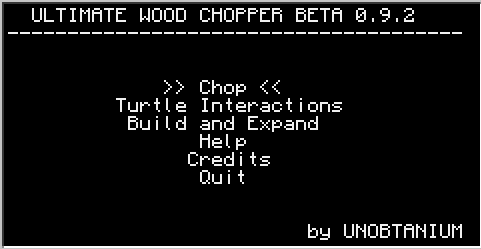
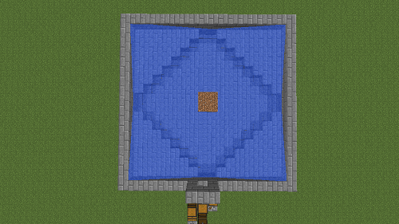
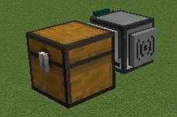
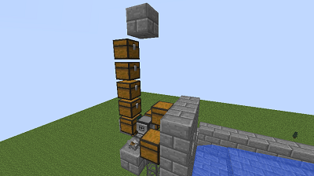
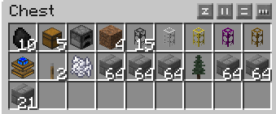
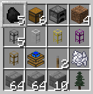
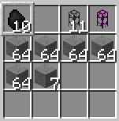
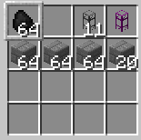

Tutorial and Demo: https://www.youtube.com/watch?v=wU_iR1DQeqI

CC Forum Post: https://web.archive.org/web/20230213095022/http://www.computercraft.info/forums2/index.php?/topic/13497-beekeeper-system-for-generikb/page__p__126409#entry126409

CC Forum Post Text:

# Ultimate Wood Chopper [0.9.5 Prerelease B][Session Persistent]

Hello Minecraftcommunity,

i presenting you my fully automated Ultimate Wood Chopper (UWC), a logger program for ComputerCraft and its Turtles.
Multiples programs are put together in this program pack to help you gain wood and saplings very fast. I hope you enjoy.
Feel free to leave some feedback. If you need help, check down below how to post a report.

No fir tree in FTB Unleashed or higher! :(

## What does Ultimate Wood Chopper?

This program can chop down single trees, both 1x1 and 2x2. You also can set up an automatic farm which replants trees either with or without bonemeal and chops it down. The farm is selfbuilding and i just recommend using Fir Wood (Saplings) for it, because the Fir Saplings dont check if there are leaves above and instantly grow if bonmeal is used on them. Fir Trees also grow in 2x2 trunks without branches. You also can set specific variables of the program for your personal usage.

## Overview video about "how to build the standard farm and expanding it" made by Seleck:
Check out his channel! He is making awesome let's plays and tutorials.

https://www.youtube.com/watch?v=wU_iR1DQeqI

## ULTIMATE WOOD CHOPPER BETA VERSION 0.9.5 prerelease B (newest):

### Pastebin:

Single Program for the Turtle:
Kngv6tWj

Rednet Computer:
PaxTx2xT

Rednet Turtle:
THa8YtH4

SingleProgram for the Turtle UWC Beta Version 0.9.0 (stable, no session persistence):
iVKtHaWk

## Features:
- very easy and user friendly
- menu
- just needs one mining turtle
- rednet (startup versions)

Farm
- saves and starts where it was left before the chunk unloaded (session persistence)
- selfbuilding
- selfsustaining
- with and without bonemeal
- fairly cheap
- controlled shutdown by a user's redstone signal or pressing a key
- debug
- expandable
- change many variables for the personal usage

Single tree
- 1x1
- 2x2
- any height

## Installation:
Label your turtle and computer to let it save the programs and save files.
label set \<name\>

Put the code in a text document without ending in ...yourMinecraftDirection\mods\ComputerCraft.zip\lua\rom\programs\turtle
Or if you are running a server you have to put it in ...yourMinecraftServerDirection\mods\ComputerCraft.zip\lua\rom\programs\turtle
Restart your Minecraft Client or Server (or both)
The computer rednet program you have to put in
...yourMinecraftDirection\mods\ComputerCraft.zip\lua\rom\programs\computer

Or you can use the pastebin import. Simply type the following words into your turtle.
pastebin get Kngv6tWj startup

## Programs:

I recommend using a mining turtle for all programs!

To enter the menu, simply tipe <code>startup</code> in the Turtle screen.

D or Enter --- Open up submenu or start program

W or Up-key --- Select menu point above

S or Down-key --- Select menu point below

A or Backspace --- Go back to the menu before

## Set up a farm

### Expanded Farm
This will build the expanded farm right away. It is much bigger then the standard farm to catch more/most saplings.
If you having a standard farm allready, you can expand it with the "Expand the standard farm" program under "Build and Expand ".
Posted Image

Place a turtle facing the direction where the tree will be and a chest behind it. The turtle ask if you want to have blocks removed in its way. However it needs a flat 18x22 free place.

Now place the following items shown in the picture in the correct order in the chest.
10 coal
5 chests
1 furnace
4 dirt
15 pipe
1 iron pipe
1 gold pipe
1 obsidian pipe
1 wooden pipe
1 redstone engine
2 lever
1 bonemeal
64 blocks
64 blocks
64 blocks
1 sapling
64 blocks
64 blocks
21 blocks

Start the program and be sure the turtle doesnt get interupted or the chunks unloaded.
Tip: You get asked, if you want the turtle to remove blocks in it's way. So you dont need to dig the 22x18x3 pit with your hands!

After building the farm, the Turtle will stay in the Base, facing the coal chest. Fill every chest with enough materials before let it start chopping the tree.
- You only need 15 charcoal (or maybe even less if the turtle has fuel left) in the charcoal chest
- The turtle needs 17+ saplings or more and 8+ bonemeal
Warning: You have to manually flip the lever for the redstone engine. You also have to put water in the right spots to transport the saplings to the obsidianpipes. You also should take out all left materials from the turtle's inventory.

You also have to be sure that no mobs can get into the water stream and block the turtle while its working. So add some fences or raise the edge of the farm a bit higher.

### Standard Farm
This program will set up your standard farm, usefull if you are just interested in wood and less the saplings. It automatically will build the layout, place chests and the piping system.
You need:
- Enough space below, around and above for the farm layout and the tree.
- 10x16x8 free area
- Turtle has to be at the coordinate 5|3|5 called Base and facing in the direction, where the tree well be.
If you have problems with position your turtle right, check out the "Position your turtle" and "Dig needed space" section down below.
- The Base is above the furnace, and at the sides are the wood chests, charcoal chest and the lever
- You need the following materials:
Use charcoal instead of normal coal. You also can use an iron furnace if you have one.
For a cheaper set up you can use cobblestonepipe/stonepipe instead of a goldpipe. If you dont have obsidian for the obsidianpipe, let your turtle dig some or do it on your own. The sapling and bonemeal are optional, but recommended as indication in which chest the supplies go.

5 charcoal
6 chests
1 furnace
4 dirt blocks
5 stone- or cobblestonepipes
1 ironpipe
1 goldpipe
1 obsidianpipe
1 woodenpipe
1 engine
2 lever
1 bonemeal (optional)
64 blocks
64 blocks
10 blocks
1 fir sapling (optional)

After building the farm, the Turtle will stay in the Base, facing the coal chest. Fill every chest with enough materials before let it start chopping the tree.
- You only need 15 charcoal (or maybe even less if the turtle has fuel left) in the charcoal chest
- The turtle needs 17+ saplings or more and 8+ bonemeal
Warning: You have to manually flip the lever for the redstone engine. You also have to put water in the right spots to transport the saplings to the obsidianpipes. You also should take out all left materials from the turtle's inventory.

There is a way to make your existing farm bigger. Check out the "How to expand your farm" section down below.
You also have to be sure that no mobs can get into the water stream and block the turtle while its working. So add some fences or raise the edge of the farm a bit higher.

### Chop Programs:

#### For Farms:
Chop -> Farm
Check the following magical three things:
- Your farm is build and all chests are filled (one or two stacks are enough.).
- The Turtle stays in the Base, facing the coal chest.
- Don't forget that the turtle needs a redstone signal, so flip the lever in the back of the turtle, otherwise it wont work.
- The turtle should have an empty inventory on it's first run to prevent bad stuff from happening.

The Turtle takes what it needs out of the chests.

If you want to shut down the turtle while it is working, simply switch the lever and the next time the turtle comes back to Base it stops.
Be sure you use the right program for the right farm (Standard or Expanded).
It's no problem if you have no bonemeal for the moment. Change the variable in the variable change menu (Chop -> Farm -> Variables).
You can change specific variables in the variables menu (Chop -> Farm -> Variables). The turtle will safe them and will load them on every start. Every turtle has their own variables and you have to/can change them for every single one individually.
Tip: The farm maybe just works with Fir Saplings, because this kind of tree doesnt wait for leaves to disappear.
If the turtle shutdown in an unloaded chunk, the turtle will restart where it was left and tries to go back to base as soon as possible. Then it will keep going until the lever got flipped. This requieres the turtle program as startup file...
If you are having problems with the turtle, you should delete the files like below in the main turtle os menu. Holding STRG + T stops a running program.

delete uwcvariables0.9.2

delete uwcsavepoint

You have to remake your variables after this.

#### For single trees:
Chop -> Single Tree
There also are single tree chop programs for 1x1 and 2x2 trees. Place the Tutle in front of the tree you want to chop down. For 2x2 trees place it on the left side. Put some fuel in the first slot (top left) and start the program. This can be used to chop down forests or trees which grew in the wrong spot.

#### Change Variables
It is possible to change variables for the farm under Chop -> Farm -> Variables.
Starting the program opens up a interface, showing you every changeable variable one by one and explains for what it is used for. You can press Enter to skip the variable and let it where it is. Tipe in a number and press Enter to change the variable. The change is shown afterwards at the top of the screen.
These variables are saved and loaded for every turtle individually.

### Help Programs:

#### Position your turtle
Help -> Help Programs -> Position

This program helps you to find the Base before the Turtle starts set up the layout. If you place your Turtle on the ground and start this program, it just goes 4 blocks up, 2 forward and 4 to the right. it will look in the direction the tree will be. Usefull if you want to build the farm up in the air.

#### Dig needed space
Help -> Help Programs -> Dig needed space

Instead of building your farm up in the air, you can let the turtle dig a hole in the ground.
The Turtle just digs enough space for building the Standard Farm. You have to manually dig more space if you want to expand your farm. This will be around 4-5 blocks to all sides.
This program needs:
- a mining turtle
- five coal in the first slot; everything else empty
- a flat ground. Stay some blocks away from the turtle and dont interrupt it.

#### Debug farm
Help -> Help Programs -> Debug

Use these programs for your farm if the turtle shutdown while chopping the tree. It removes all left wood blocks.
The Turtle has to stay in the base, facing the coal chest. It just need some coal in the first slot.
Here too: Be sure you use the right program for the right farm. You have to manually take out the coal and the wood.

#### Go Down
Help -> Help Programs -> Go Down

The turtle will move down until it hits a block. Useful if using rednet and the turtle was stuck in the tree.

### How to expand your farm:

Build & Expand

#### Add more chests
If you want more wood storage, simply place the amount of chests you want to add in the second slot. Some coal in the first slot. The turtle has to stay in base.
If you want to store even more wood, you can use double chests or an other kind of chest (e.g. diamondchest).
The turtle will the block above the chests, which needs a mining turtle. Have all other inventory slots empty.

#### Expand your farm

This program increases the size of the sapling collecting area of your standard farm. Nearly every sapling will get pulled into the sapling chest to use these for biomass production or something else.
You have to use a mining turtle for this program, because the turtle will go and remove parts of the standard farm and use these blocks for the expanded farm.

The Mining Turtle has to stay in the Base facing the charcoal chest.
Be sure you dont have water in the farm left. Otherwise it will flow all over the place!
Put the following materials in the Turtle. You dont need that much coal. Around 10 should be okay.

10 coal
free slot
11 stone- or cobblestonepipe
1 obsidianpipe
64 blocks
64 blocks
64 blocks
20 blocks
all 8 left slots should be free!

The turtle will remove the layout of the standard farm and uses these blocks for the expanded farm, so please be sure, which type of block you are using. For example Stone drops Cobblestone and then you get a stone-cobblestone-expanded farm instead of pure stone expanded farm. So please use this patter if you are using such a type of block:

10 coal
free slot
11 stone- or cobblestonepipe
1 obsidianpipe
64 blocks
64 blocks
64 blocks
64 blocks
64 blocks
7 blocks
all 6 left slots should be free!

You have to put water in the four corners to transport all saplings to the obsidianpipe.
You have to use the chop program for expanded farms.
You also have to be sure that no mobs can get into the water stream and block the turtle while its working. So add some fences or raise the edge of the farm a bit higher.

### Rednet:
The rednet version comes in a program for the turtle and the computer. The programs are made as a startup program, so you can go ahead and navigate the turtle out of the tree if it got stuck in it. The computer has the same menu as the normal program, but just shows if it reached a turtle or not. In the rednet version you are not able to change the variables of the turtle yet. Please use the normal program for this, because it will use these in the rednet program too.
Especially for the rednet version there is a program under Help -> Help Programs -> Go down which simply let's the turtle go down until it hits a block underneath. That makes it easy to call the turtle back out of the tree if it got shutdown while chopping.
You also can set up multiple turtle and start them all from one computer at the same time. That might be a good use if you chop down a whole forest too.

### Turtle Interactions
This program is made to easily navigate your turtle. For more informations check out Turtle Interactions

### To-Do:
Before I release Version 1.0 i want to have this list finished or even more points.
- maybe let someone with english skills rewrite the whole post (if someone want to or knows someone, let me know)
- improve the rednet version so that the turle wont need a redstone signal anymore

## Updates:

### Beta Version 0.9.5 prerelease B
- fix from prerelease A didn't worked... new fix is out.

### Beta Version 0.9.5 preprelease A
- found the potentional mistake in the code for the "digging down to bedrock" bug
- turtle now detects if a tree is grown while it was shutdown while waiting for it to grow

### Beta Version 0.9.5 prerelease (making changes to the code)
- fixed program: build standard farm, build expanded farm, expand standard farm
- the player now can terminate the presistence within 5 seconds by pressing a key
- added an overview menu for changing the variables.
- Fixed a lot in build programs -> a lot of new bugs
- changed once again, how the turtle detects if the tree grew or not. Turtle doesnt get destroyed by leaves anymore.

### Beta Version 0.9.4
-added "build the expanded farm right away" program: builds the expanded farm without building and destroying the standard farm; also digs out the needed space for the farm!
- removed build, expand and various help programs from the rednet version
- updated the test world
- improved chopping and position saving: lowered the rate of saving the turtle's position while chopping the tree; now destroys a block on the right of the tree to detect when its done
- improved refueling and handling of blocks in the way of the "building standard farm" and "expanding standard farm" program
- improved waiting for the tree to grow: turtle makes a step back while waiting for the tree to grow/if the bonemeal failed to grow the tree. Allows jungle trees to grow. However the turtle program does not get rid of wood trunks!!!
- improved material gathering the third time
- fixed turtle refueling for the "build expanded farm" program
- fixed bonemeal gathering
- fixed Session Persistence; turtle didnt worked correctly after restart when using the expanded farm in the single program
- rewrote parts of the original post

### Beta Version 0.9.3
- added new build program: expanded farm
- removed various build, expand and help programs from the rednet version
- fixed build programs; turtle didnt placed a block near the base

### Beta Version 0.9.2
- fixed bug in the farm programs: now the turtle does not remove the dirt platform anymore... sorry for that!!
- fixed bug in the farm programs: Turtle doesnt get destroyed by the tree itself anymore.
- fixed bug in the farm programs: Turtle does take out bonemeal and saplings correctly now if no items where in slot 1 and 2.
- fixed bug in the farm programs: Turtle now cuts down the tree if it grew after using bonemeal on it
- fixed 2x2 single tree program
- added two more variables: use persistence and how many bonemeal should be use at the same time
- improved code: made the code shorter by compressing the menus in two dimensional arrays -> 400 lines of code are gone
All your individual variables have to be remake again! Hopefully the last time even if i add more variables in the future.

### Beta Version 0.9.1
- added session reload; turtle will restart its work after shutdown
- improved and changed tree detection; needs fuel to do this
- removed no-bonemeal menu programs; added variable for it
- changed supply gathering once again; Now checks if it has bonemeal and saplings taken out of the chests as well as it could be.
All your individual variables have to be remake! To let the turtle use or dont use bonemeal, you have to change this variable in the change variable menu (Chop -> Farm -> Variables). You also should name your programs as 'startup' to become the session reload effective.

### Beta Version 0.9.0
- fixed a bug when switching between the programs with and without bonemeal didnt worked correctly
- lowered the amount of wood thrown into the furnace for less overflow in the coalchest; 16 if with bonemeal and 8 without bonemeal; overflow around 16 per normal chest full of wood
- improved and redid the menu; added more sub menus for better navigation and usage
- improved farm programs; now refuels at the charcoal chest instead of transporting it around; has one more slot left for wood; saplings in slot 1 and bonemeal in slot 2
- improved chop programs, added timer after using bonemeal on a sapling which failed growing the tree; added timer before the first bonemeal is getting used
- added credits
- added turtle interactions; easy way to control the turtle without knowing lua or turtle commands
- added the posibility of changing specific variables for the farm
- added rednet

### Beta Version 0.8.6
- improved chop program; fixed bonemeal bug and increased the amount of minimum materials needed

### Beta Version 0.8.5
- some minor changes; special thanks goes to: Mtdj2
- improved single tree chop programs; removed function getCoal()

### Beta Version 0.8.4
- improved and changed digging program; now digs enough space to place blocks
- fixed chop program; if-statement crashed the whole program
- improved "Dig needed space" section in the post; mentioned that you have to have a flat ground

### Beta Version 0.8.3
- added "Dig needed space" program and section in the post
- improved chop programs which dont use bonemeal; Turtle comes back to Base every second tree instead of every fifth

### Beta Version 0.8.2
- improved chop programs; takes out materials better now
- improved build program; now detects a block underneath the turtle and give a error

### Beta Version 0.8.1
- fixed building program; stopped building while building the floor.
- fixed expand program; didnt stopped at the end
- improved help interface; there was the old name shown instead of uwc

### Beta Version 0.8
- changed the name from FIR WOOD CHOPPER to ULTIMATE WOOD CHOPPER
- added single tree chop programs
- added expand chests program

### Beta Version 0.7.2
- improved build program; you dont have to use a wrech on the wooden- and ironpipe
- improved expand program, now removes some blocks under the sapling collecting area to place the pipe. The way out is made less bugfree

### Beta Version 0.7.1
- improved menu navigation; now does not stop at the top option and bottom option
- fixed expand program, now does not select slot 17 if all blocks are used.
- added notation that you need a mining turtle in the Program section in the post.
- special thanks goes to: Kravyn

### Beta Version 0.7
- fixed expand program; now consumes enough charcoal to finish expanding the farm.
- added 2 new programs in the chop programs menu; these dont need bonemeal, the Turtle just waits for the tree to grow.

### Beta Version 0.6.2
- changed chop program; the program does say now that it has too less materials in the chest instead of saying that there is nothing in it

### Beta Version 0.6.1
- change variables which might caused problems while building and expanding
- improved user controll; user can terminated refuelling at the chests, turtle moves automatically back to Base
- special thanks goes to: TheOriginalBIT
- added a creative test world for everybody who want to check out how it works

### Beta Version 0.6
- put all programs in one and added menu for better usage
- special thanks goes to: NitrogenFingers on Youtube for the menu tutorial
- rewrote stuff in the first post

### Beta Version 0.5
- fixed build program; some bugfixes
- added new program FWCchop2 ; it is used for the xpanded farms, because the dirt blocks are two blocks further away then.
- improved the pastebin links;

### Beta Version 0.4
- improved build program, added some functions for better understanding
- improved chop program, now says what the Turtle is doing and where it is struggeling.
- added new program FWCexpand, expands the farm for more saplings

### Beta Version 0.3
- fixed chop program; now does cut the tree instead of replanting 24/7 sorry for that file:///C:/Users/Marius/AppData/Local/Temp/msohtmlclip1/01/clip_image001.png
- special thanks goes to: Hoppingmad9

### Beta Version 0.2
- fixed debug program; didnt chop down the whole tree sometimes
- fixed chop program; now stores wood and detects if the tree is grown
- improved help program; everything can be read now
- changed and improved layout; less materials
- added "How to expand your farm" in the post
- changed the host provider; photos are shown now without clicking on the link

## Found a bug, got an error or something didnt worked?

### Questions & Answer:

#### The turtle digs down (to bedrock)!!!

Allready known bug, i am working on a fix for i. Be patient and use the newest version.

#### I want to deinstall the program!

Copy this code into the turtle's screen:
delete startup

#### The turtle says it refuels, but nothing happens or i get an error.

You are in infinite fuel mode. This program is ment for survival and therefore turtles need fuel to move. I do not support infinite mode at this moment, because most people dont play with it.

#### The turtle doesnt not place various blocks correctly.

Might be a ComputerCraft bug. Reinstall the Computercraft mod and try it again. If the turtle still does not work, post a bug report here.

#### The turtle has wrong items in its inventory or in the chests.

Check if your chests are not full, especial the charcoal, bonemeal and sapling chest.

#### The turtle says that its shutdown while working and tries to go to work again.

You should be able to press a key within 5 seconds before the session persistence triggers.
You also can terminate any program at any point like this:
Quickly press and hold STRG + T until the program gets terminated. Then type in the following code into the turtle screen:
delete uwcsavepoint

#### I want to reset all my variables for the farm.

Exit the program and type in the following code into the turtle screen:
delete uwcvariables0.9.2

#### Something is strange or you even get a error message, please fill in this following layout and post it in this post:

Does the problem still occures if uwc gets redownloaded:

FTB Version:

Singleplayer or Multiplayer:

Error Code:

What happened:

This is helping me a lot to simply find where your problem is and hopefully how to fix it. If you get an error please write it down too. Mention which programs you where using and what/how many items in the turtle and chests were.

That's it! I hope i didn't forget anything. Btw, my english isnt the best :/

Because the program is still in beta i cant say that it is bugfree!

If there are any questions, suggestions, errors or bugs, feel free to leave a comment to improve this program pack.

Thank you for your attention.

UNOBTANIUM

